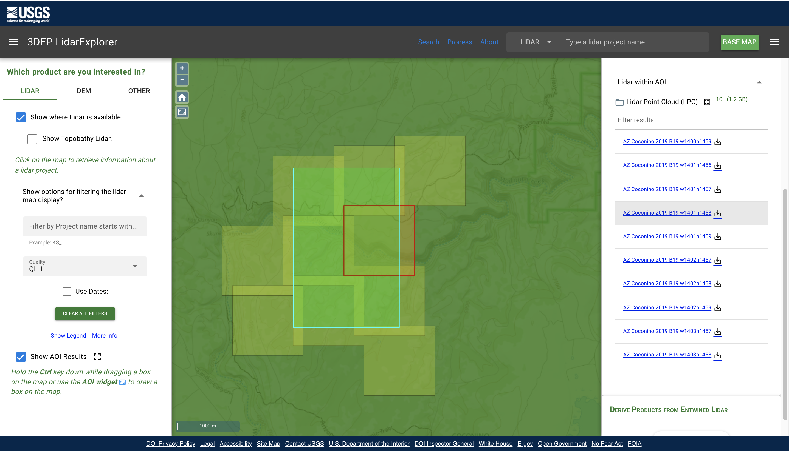

```{r, include=FALSE}
options(warn=-1)
```

In this project, I created a workflow to compare GEDI and ICESat-2 against high-quality discrete-return LiDAR data for an area of interest. 

The main steps are to:
- download and subset ICESat-2 data for an area of interest
- create spatial geometries from ICESat-2 and GEDI data csv files
  - this involved creating different geometries for the two instruments, because they
  have different pulse footprints
- extract corresponding discrete-return data for each geometry and calculate
height metrics
- intersect geometries with forest group and forest cover layers and calculate summary values for each polygon
- plot the results

Code for the project is available [here]()

<h2> Part 1. Download Data </h2>
<p> In R, define the boundary. </p>
```{r, messages = F}
xmin=-111.5872356
xmax=-111.538214
ymin=35.1363133
ymax=35.159778
```
<p> Now write to boundary to a shapefile. The resulting shapefile can be used to find overlapping files in the data portals. </p>
```{r, eval = F}
source('./write_boundary_shp.R')
write_boundary_shp(xmin, xmax, ymin, ymax, './boundary/boundary.shp')
```
<h4> Discrete-Return LiDAR Data </h4>
<p>Download 3DEP USGS Discrete-Return LiDAR Data within the area of interest using the USGS LidarExplorer: https://prd-tnm.s3.amazonaws.com/LidarExplorer/index.html#</p>



<h4> GEDI </h4>

<p>Download GEDI Level 2A Version 2  Data from https://search.earthdata.nasa.gov/</p>
<p> I uploaded the shapefile of the boundary area and found 9 GEDI granules that intersect the area of interest. The download urls are shown below. *Note, these files are large ~ 2 Gb each*. <br>
https://e4ftl01.cr.usgs.gov//GEDI_L1_L2/GEDI/GEDI02_A.002/2021.07.05/GEDI02_A_2021186140546_O14513_03_T03204_02_003_02_V002.h5<br>
https://e4ftl01.cr.usgs.gov//GEDI_L1_L2/GEDI/GEDI02_A.002/2021.06.21/GEDI02_A_2021172123028_O14295_02_T06887_02_003_02_V002.h5<br>
https://e4ftl01.cr.usgs.gov//GEDI_L1_L2/GEDI/GEDI02_A.002/2021.01.28/GEDI02_A_2021028044259_O12058_03_T06203_02_003_02_V002.h5<br>
https://e4ftl01.cr.usgs.gov//GEDI_L1_L2/GEDI/GEDI02_A.002/2021.01.08/GEDI02_A_2021008123045_O11753_03_T08896_02_003_02_V002.h5<br>
https://e4ftl01.cr.usgs.gov//GEDI_L1_L2/GEDI/GEDI02_A.002/2020.06.03/GEDI02_A_2020155031743_O08352_03_T00511_02_003_01_V002.h5<br>
https://e4ftl01.cr.usgs.gov//GEDI_L1_L2/GEDI/GEDI02_A.002/2019.11.26/GEDI02_A_2019330230004_O05419_02_T05464_02_003_01_V002.h5<br>
https://e4ftl01.cr.usgs.gov//GEDI_L1_L2/GEDI/GEDI02_A.002/2019.10.31/GEDI02_A_2019304093108_O05007_02_T04041_02_003_01_V002.h5<br>
https://e4ftl01.cr.usgs.gov//GEDI_L1_L2/GEDI/GEDI02_A.002/2019.07.09/GEDI02_A_2019190134530_O03241_03_T04780_02_003_01_V002.h5<br>
https://e4ftl01.cr.usgs.gov//GEDI_L1_L2/GEDI/GEDI02_A.002/2019.04.23/GEDI02_A_2019113131121_O02045_02_T01195_02_003_01_V002.h5<br>
</p>

<h4> ICESat-2 </h4>
<p> Download ICESat-2 L3A Land and Vegetaion Height, Version 5 data using the python download script, nsidc-download_ATL08.005_2021-12-01.py, that is automatically generated at https://nsidc.org/data/atl08 <br><br>
In a terminal, run the following:</p>

```{bash, eval = F}
py ./nsidc-download_ATL08.005_2021-12-01.py
```

<h2> Part 2. Spatially Subset the Data </h2>

<p> Spatially subset the GEDI data by cloning the GEDI-subsetter by Cole Krehbiel from https://git.earthdata.nasa.gov/projects/LPDUR/repos/gedi-subsetter/browse/GEDI_Subsetter.py

<br> In a terminal, run the following: 
<p>

```{bash, eval = F}
conda create -n gedi -c conda-forge --yes python=3.7 h5py shapely geopandas pandas
conda activate gedi
python ./gedi-subsetter/GEDI_Subsetter.py --dir ./data/0_orig/gedi/ --roi 35.159778,-111.5872356,35.1363133,-111.538214 
```

<p> Spatially subset the ICESat-2 data and convert from hdf to csv. </p>
<p> *Note: From this point on, all code is written for R.* </p>


```{r, eval = F}
source('./hdf_to_csv.R')
hdf_to_csv('./data/0_orig/icesat2/','./data/1_subset/icesat2/icesat2.csv', ymax, xmin, ymin, xmax)
```

<h2> Part 3. Create Spatial Geometries  </h2>
<p> Convert the given centroid coordinates for the ICESat-2 and GEDI footprint to spatial geometries . This process results in 100m x 14m rectangles for the ICESat-2 canopy data and 25m dimater circles for the GEDI data. </p>
```{r, eval = F}
# define a projected coordinate system to use for spatial manipulation
projection = sp::CRS("+proj=aea +lat_1=29.5 +lat_2=45.5 +lat_0=23 +lon_0=-96 +x_0=0 +y_0=0 +ellps=GRS80 +towgs84=0,0,0,0,0,0,0 +units=m +no_defs")

source('./icesat2_csv_to_geometries.R')
csv_to_geometries(csv_path = './data/1_subset/icesat2/icesat2.csv',
                  geometry_path = './data/1_subset/icesat2/icesat2.shp', 
                  proj = projection)

source('./gedi_json_to_geometries.R')
json_to_geometries(json_path = './data/1_subset/gedi/',
                   './data/1_subset/gedi/gedi.shp', 
                   proj = projection)
```

<p> Now let's visualize the spatial relationship of the datasets. </p>
```{r messages=F}
# load the saved shapefiles
boundary = rgdal::readOGR('./boundary/boundary.shp', verbose = F)
icesat_geoms = rgdal::readOGR('./data/1_subset/icesat2/icesat2.shp', verbose = F)
gedi_geoms = rgdal::readOGR('./data/1_subset/gedi/gedi.shp', verbose = F)

library(leaflet); 

# produce the map
leaflet() %>%
  setView(lng = (xmin + xmax)/2, lat = (ymin + ymax)/2, zoom = 14) %>%
  addProviderTiles(providers$Esri.WorldImagery, options = providerTileOptions(opacity = 0.5)) %>%
  addPolygons(data = icesat_geoms, fillColor = "blue", fillOpacity = 0.3, stroke = FALSE) %>%
  addPolygons(data = gedi_geoms, fillColor = "red", fillOpacity = 0.5, stroke = FALSE) %>%
  addPolygons(data = boundary, color = "black", fillOpacity = 0) %>%
  addLegend(colors = c("blue","red","black"), labels = c("ICESat-2 footprints", "GEDI footprints","3DEP coverage"), opacity = 1)

```


<h2> Part 4. Extract Discrete-Return Values for Satellite Footprints </h2>
<p> In the following code, a function is defined to calculate relative height metrics from the intersecting part of the discrete-return point cloud for each satellite footprint and output the resulting data as a csv.</p>

```{r extract_ALS_metrics, eval = F}
#  Define function to calculate height metrics for aerial LiDAR Survey (ALS) data within geometries
extract_ALS_metrics = function(sensor, geom_path, output_path, ALS_dir, ctg_path, proj){
  # Author: Laura Puckett
  # 08/26/2020
  # Purpose: extract discrete-return Aerial LiDAR Survey (ALS) data within a given polygon, calculate relative height metrics, and output results as a csv file. 
  
  list.of.packages <- c("lidR","rgdal", "raster","dplyr", "sp")
  
  new.packages <- list.of.packages[!(list.of.packages %in% installed.packages()[,"Package"])]
  if(length(new.packages)>0) install.packages(new.packages, repos='http://cloud.r-project.org')
  
  library(lidR); library(rgdal); library(raster); library(dplyr); library(sp)
  
  if(file.exists(ctg_path)){
    ctg = readRDS(ctg_path)
  }else{
    ctg = readLAScatalog(ALS_dir)
    saveRDS(object = ctg, file = ctg_path)
  }
  
  geoms_WGS84 = rgdal::readOGR(geom_path)
  geoms = spTransform(geoms_WGS84, proj)
  data = NULL
  
  # clip point cloud to a buffered version of the geometry (keeping edges for ground surface interpolation)
  for(i in 1:nrow(geoms@data)){
    print(i)
    geom = geoms[i,]
    
    las_bufferclip = lidR::clip_roi(las = ctg, geometry = rgeos::gBuffer(geom, 5, byid=T))
    if(nrow(las_bufferclip@data)>0){
      
      # normalize point cloud to the ground
      norm_las = normalize_height(las_bufferclip, knnidw())
      
      ## Summarize point cloud over entire geometry
      norm_las_clip = clip_roi(norm_las, geom)
      if(length(norm_las_clip@data$NumberOfReturns)>0){
        # filter for unclassified or vegetation points
        veg = filter_poi(norm_las_clip, Classification %in% c(1L, 3L, 4L, 5L))
        # calculate metrics defined in myMetrics function
        las_met = cloud_metrics(las = norm_las_clip,  func = myMetrics(Z)) 
        geom_data = cbind(geom@data, as.data.frame(las_met))
        
        # can't rbind to NULL, so using this to initialize the dataframe
        if(is.null(data)){
          data = geom_data
        }else{
          data = rbind(data, geom_data)
        }
      }
    }
  }
  write.csv(data, output_path)
}

myMetrics = function(z) {
  metrics = list(
    RH_100_ALS = quantile(z, probs = c(1.00)),
    RH_99_ALS = quantile(z, probs = c(0.99)),
    RH_98_ALS = quantile(z, probs = c(0.98)),
    RH_95_ALS = quantile(z, probs = c(0.95)),
    RH_75_ALS = quantile(z, probs = c(0.75)),
    RH_50_ALS = quantile(z, probs = c(0.50)),
    RH_25_ALS = quantile(z, probs = c(0.25)))
  return(metrics)
}
```

<p> Now, use the function to calculate relative height metrics from the ALS data overlapping each satellite footprint. </p>
```{r, eval = F}
extract_ALS_metrics(sensor = "icesat2", 
                    geom_path = "./data/1_subset/icesat2/icesat2.shp",
                    output_path = "./data/2_joined/icesat_ALS.csv", 
                    ALS_dir = './data/0_orig/USGS/', 
                    ctg_path = './data/ctg.RDS',
                    proj = projection)

extract_ALS_metrics(sensor = "gedi", 
                    geom_path = "./data/1_subset/gedi/gedi.shp",
                    output_path = "./data/2_joined/gedi_ALS.csv", 
                    ALS_dir = './data/0_orig/USGS/', 
                    ctg_path = './data/ctg.RDS',
                    proj = projection)
```
<h2> Part 5. Compare the Datasets </h2>

```{r, message=F}
library(plotly); library(dplyr)

icesat = read.csv('./data/2_joined/icesat_ALS.csv') %>%
  dplyr::select(cn_h_25, cn_h_50, cn_h_75, cn_h_95,cn_max, 
                RH_25_ALS, RH_50_ALS,RH_75_ALS, RH_95_ALS, RH_98_ALS, RH_100_ALS) %>%
  mutate(sensor = "ICESat-2") %>%   # remove No Data values 
  filter(cn_max < 3.402823e+23) %>%
  rename(RH_25_sat = cn_h_25,
         RH_50_sat = cn_h_50,
         RH_75_sat = cn_h_75,
         RH_95_sat = cn_h_95,
         RH_100_sat = cn_max)

gedi = read.csv('./data/2_joined/gedi_ALS.csv') %>%
  dplyr::select(rh_25, rh_50, rh_75, rh_95, rh_100,
                RH_25_ALS, RH_50_ALS,RH_75_ALS, RH_95_ALS, RH_98_ALS, RH_100_ALS) %>%
  mutate(sensor = "GEDI") %>%
  rename(RH_25_sat = rh_25,
         RH_50_sat = rh_50,
         RH_75_sat = rh_75,
         RH_95_sat = rh_95,
         RH_100_sat = rh_100)

combined = rbind(icesat,gedi)

plot_ly() %>% 
  layout(title = "Comparison of Canopy Height Values [m] ",
         yaxis=list(title='Satellite Data'),
         xaxis = list(title = "3DEP Discrete-Return Data")) %>%
  add_trace(data = combined,
            name = ~sensor,
            type = "scatter",
            color = ~sensor,
            x = ~RH_98_ALS,
            y = ~RH_100_sat)
```

```{r}
# reform data with a single column for RH 
by_RH_GEDI = combined %>%
  filter(sensor == "GEDI") %>%
  gather(key = "RH_num_type", value = "value", -sensor) %>%
  mutate(RH = substr(RH_num_type, "_")[2],
         type = substr(RH_num_type, "_")[3])

plot_ly() %>% 
  layout(title = "Comparison of Canopy Height Values [m] ",
         yaxis=list(title='Satellite Data'),
         xaxis = list(title = "3DEP Discrete-Return Data")) %>%
  add_trace(data = combined,
            name = ~sensor,
            type = "scatter",
            color = ~sensor,
            x = ~RH_98_ALS,
            y = ~RH_100_sat)

```

plot_ly() %>% 
  layout(title = "Comparison of Relative Height Values [m] ",
         yaxis=list(title='Satellite Data'),
         xaxis = list(title = "3DEP Discrete-Return Data")) %>%
  add_trace(data = combined,
            name = ~sensor,
            type = "scatter",
            color = ~sensor,
            x = ~RH_98_ALS,
            y = ~RH_max_sat)


```
<p> Overall, there is a clear relationship between values from the satellite instruments and
high-quality 3DEP discrete-return LiDAR data. However, there are some outliers and more could be done to explore these relationships. Filtering for nighttime data, GEDI strong beams, and thresholds for the quality flags would yield the highest quality data for filtering. However, that may not leave us with much data in the small area used for this example. 

Here is an example where those filters were used in an analysis done in 2020. The data is from a larger area near Lake Tahoe. The code for this project was slightly different because the project was set up to run on a high-performance computing cluster due to the large size of the datasets. That code is available on the "NAU" fork of the same repository. 
</p>


```{r, include=FALSE}
options(warn=0)
```

<h3> Dataset References </h3>

<p>
Dubayah, R., Tang, H., Armston, J., Luthcke, S., Hofton, M., Blair, J. (2020). <i>GEDI L2B Canopy Cover and Vertical Profile Metrics Data Global Footprint Level V001</i> [Data set]. NASA EOSDIS Land Processes DAAC. Accessed 2021-11-30 from https://doi.org/10.5067/GEDI/GEDI02_B.001
<br>

Neuenschwander, A. L., K. L. Pitts, B. P. Jelley, J. Robbins, B. Klotz, S. C. Popescu, R. F. Nelson, D. Harding, D. Pederson, and R. Sheridan. 2021. ATLAS/ICESat-2 L3A Land and Vegetation Height, Version 5. [Indicate subset used]. Boulder, Colorado USA. NASA National Snow and Ice Data Center Distributed Active Archive Center. doi: https://doi.org/10.5067/ATLAS/ATL08.005. [2020-12-01].
<br>

AZ Coconino 2019 B19: Discrete-Return LiDAR Data downloaded from [USGS 3DEP LiDAR Explorer](https://prd-tnm.s3.amazonaws.com/LidarExplorer/index.html#/) [2020-11-30]
<br>
</p>

<h2> Appendix </h2>

<h5> write_boundary_shp Function </h5>
```{r write_boundary_shp, eval = F}
write_boundary_shp = function(xmin, xmax, ymin, ymax, filepath){
  # Author: Laura Puckett. 
  # 11/30/2021
  # Purpose: Write a shapefile from bounding box coordinates in WGS84.
  library(sp); library(rgdal); 
  
  coords = c(c(xmin, xmin, xmax, xmax),c(ymin, ymax, ymax, ymin))
  
  Srl = NULL
  x = c(xmax, xmax, xmin, xmin, xmax)
  y = c(ymin, ymax, ymax, ymin, ymin)
  poly = Polygon(coords = cbind(x, y))
  Polygons_obj = Polygons(srl = c(poly), ID = as.numeric(1))
  Srl = append(Polygons_obj, Srl)
  
  Sr = SpatialPolygons(Srl = Srl, proj4string = sp::CRS("+proj=longlat +datum=WGS84 +ellps=WGS84 +towgs84=0,0,0"))
  spdf = SpatialPolygonsDataFrame(Sr = Sr, data = as.data.frame(NA), match.ID = T)
  spdf@data = data.frame("X" = 1)
  writeOGR(obj = spdf,
           dsn = filepath,
           layer = 'boundary',
           overwrite_layer = T,
           driver = 'ESRI Shapefile')
}
```
<h5> hdf_to_csv Function </h5>
```{r hdf_to_csv, eval = F}
hdf_to_csv = function(icesat_dir, output_path, ymax, xmin, ymin, xmax){
  
  # *********************************************************************************#
  # -----0. Packages
  # ********************************************************************************#
  if (!requireNamespace("BiocManager", quietly = TRUE))
    install.packages("BiocManager")
  if (!requireNamespace("rhdf5", quietly = TRUE))
    BiocManager::install("rhdf5")
  library(rhdf5)
  
  # *********************************************************************************#
  # -----1: Body
  # ********************************************************************************#
  icesat_files = list.files(icesat_dir, pattern = "h5", recursive = TRUE)
  # print(c("icesat files: ", icesat_files))
  
  df = NULL
  count=0
  for(beam in c("1l","1r","2l","2r","3l","3r")){
    for (filename in icesat_files){
      tmp = try(rhdf5::h5read(file = paste0(icesat_dir, filename), paste0("/gt", beam, "/")), silent = TRUE)
      # in some .h5 files, there isn't info for every beam
      if(class(tmp) == "try-error"){
        print(paste0("Information from file ", filename, "is missing for beam ", beam))
      }else if(is.null(tmp$land_segments)==FALSE){
        df.tmp = NULL
        
        # extract metadata
        df.tmp = cbind(df.tmp, "seg_id_beg" = tmp$land_segments$segment_id_beg)
        df.tmp = cbind(df.tmp, "seg_id_end" = tmp$land_segments$segment_id_end)
        df.tmp = cbind(df.tmp, "lat" = as.numeric(tmp$land_segments$latitude))
        df.tmp = cbind(df.tmp, "lon" = as.numeric(tmp$land_segments$longitude))
        df.tmp = cbind(df.tmp, "h_te_mean" = as.numeric(tmp$land_segments$h_te_mean))
        df.tmp = cbind(df.tmp, "n_te_photons" = as.numeric(tmp$land_segments$n_te_photons))
        df.tmp = cbind(df.tmp, "h_te_uncertainty" = as.numeric(tmp$land_segments$h_te_uncertainty))
        df.tmp = cbind(df.tmp, "terrain_slope" = as.numeric(tmp$land_segments$terrain_slope))
        df.tmp = cbind(df.tmp, "night_flag" = tmp$land_segments$night_flag)
        df.tmp = cbind(df.tmp, "landcover" = tmp$land_segments$segment_landcover)
        
        # extract canopy related values
        df.tmp = cbind(df.tmp, "cn_mean" = tmp$land_segments$canopy$h_mean_canopy)
        df.tmp = cbind(df.tmp, "cn_max"  = tmp$land_segments$canopy$h_max_canopy)
        df.tmp = cbind(df.tmp, "h_can"  = tmp$land_segments$canopy$h_canopy)
        df.tmp = cbind(df.tmp, "cn_med"  = tmp$land_segments$canopy$h_median_canopy)
        df.tmp = cbind(df.tmp, "cn_h_25" = unlist(tmp$land_segments$canopy$canopy_h_metrics)[1,])
        df.tmp = cbind(df.tmp, "cn_h_50" = unlist(tmp$land_segments$canopy$canopy_h_metrics)[2,])
        df.tmp = cbind(df.tmp, "cn_h_60" = unlist(tmp$land_segments$canopy$canopy_h_metrics)[3,])
        df.tmp = cbind(df.tmp, "cn_h_70" = unlist(tmp$land_segments$canopy$canopy_h_metrics)[4,])
        df.tmp = cbind(df.tmp, "cn_h_75" = unlist(tmp$land_segments$canopy$canopy_h_metrics)[5,])
        df.tmp = cbind(df.tmp, "cn_h_80" = unlist(tmp$land_segments$canopy$canopy_h_metrics)[6,])
        df.tmp = cbind(df.tmp, "cn_h_85" = unlist(tmp$land_segments$canopy$canopy_h_metrics)[7,])
        df.tmp = cbind(df.tmp, "cn_h_90" = unlist(tmp$land_segments$canopy$canopy_h_metrics)[8,])
        df.tmp = cbind(df.tmp, "cn_h_95" = unlist(tmp$land_segments$canopy$canopy_h_metrics)[9,])
        df.tmp = cbind(df.tmp, "cn_open" = tmp$land_segments$canopy$canopy_openness)
        df.tmp = cbind(df.tmp, "toc_rough" = tmp$land_segments$canopy$toc_roughness)
        df.tmp = cbind(df.tmp, "cn_unc" = tmp$land_segments$canopy$h_canopy_uncertainty)
        df.tmp = cbind(df.tmp, "cn_pho" = tmp$land_segments$canopy$n_ca_photons)
        df.tmp = cbind(df.tmp, "toc_pho" = tmp$land_segments$canopy$n_toc_photons)
        df.tmp = cbind(df.tmp, "cn_close" = tmp$land_segments$canopy$canopy_closure)
        df.tmp = cbind(df.tmp, "n_pho" = tmp$land_segments$canopy$n_photons)
        
        # add up canopy flags across the 5 sections of the canopy segment
        sub_cn_flag_sum = unlist(tmp$land_segments$canopy$subset_can_flag)[1,] + 
          unlist(tmp$land_segments$canopy$subset_can_flag)[2,] + 
          unlist(tmp$land_segments$canopy$subset_can_flag)[3,]+ 
          unlist(tmp$land_segments$canopy$subset_can_flag)[4,] + 
          unlist(tmp$land_segments$canopy$subset_can_flag)[5,]
        df.tmp = cbind(df.tmp, "sub_cn_flag_sum" = sub_cn_flag_sum)
        df.tmp = cbind(df.tmp, "ls_flag" = tmp$land_segments$canopy$landsat_flag)
        
        # Add Information Included in the Filename 
        df.tmp = as.data.frame(df.tmp)
        df.tmp = cbind(df.tmp, "beam" = beam)
        df.tmp = cbind(df.tmp, "filename" = filename)
        df.tmp = cbind(df.tmp, "year" = substr(filename, 7, 10))
        df.tmp = cbind(df.tmp, "month" = substr(filename, 11, 12))
        df.tmp = cbind(df.tmp, "day" = substr(filename, 13, 14))
        df.tmp = cbind(df.tmp, "hhmmss" = substr(filename, 15,20))
        df = rbind(df, df.tmp)
      }
    }
  }
  
  # Spatially subset the data 
  print(nrow(df))
  print("filtering for bounding box")
  df = df[which(df$lat>ymin & df$lat<ymax & df$lon>xmin & df$lon<xmax),]
  
  write.csv(df, output_path)
}
```
<h5> csv_to_geometries Function </h5>
```{r csv_to_geometries, eval = F}
csv_to_geometries = function(csv_path, geometry_path, proj){
  # Author: Laura Puckett
  # 08/26/2020
  # Purpose: Convert a csv file of icesat-2 data into a shapefile of spatial geomtries representing the footprint of the canopy-level data, which is aggregated every 100m along-track. 
  
  print("---Arguments---")
  print(paste0("icesat path: ", csv_path))
  print(paste0("geometry_path: ", geometry_path))
  print(paste0("proj: ", proj))
  
  ####------------------------------------------------------------------------####
  #### Create footprint geometries
  ####------------------------------------------------------------------------####
  
  # https://nsidc.org/sites/nsidc.org/files/technical-references/ICESat2_ATL08_data_dict_v003.pdf
  # states that lat and long are expressed as the center-most photon, aggregated in 100m chunks
  
  # https://nsidc.org/sites/nsidc.org/files/technical-references/ICESat2_ATL08_ATBD_r003.pdf
  # states that the diameter for the 100m aggregated tracks is about 14m
  
  icesat_data = read.csv(csv_path, stringsAsFactors = FALSE)
  
  coord <- cbind(as.numeric(icesat_data$lon), as.numeric(icesat_data$lat))
  icesat_spdf = sp::SpatialPointsDataFrame(coord, icesat_data)
  rm(coord)
  sp::proj4string(icesat_spdf) = sp::CRS("+proj=longlat +datum=WGS84 +ellps=WGS84 +towgs84=0,0,0")
  icesat = spTransform(icesat_spdf, proj)
  rm(icesat_data)
  
  footprint_spdf = NULL
  print(paste0("total number of points: ", nrow(icesat@data)))
  
  for(footprintNum in 1:nrow(icesat@data)){
    print(footprintNum)
    
    ####------------------------------------------------------------------------####
    #### get data from one icesat-2 point for a single beam
    ####------------------------------------------------------------------------####
    point = sp::SpatialPointsDataFrame(
      coords = cbind(icesat@coords[footprintNum,1], icesat@coords[footprintNum,2]),
      proj4string = proj,
      data = icesat@data[footprintNum,])
    
    ####------------------------------------------------------------------------####
    #### make the geometry for the rectangular footprint of the point
    ####------------------------------------------------------------------------####
    # the idea here is to:
    # (a) use a pair of points to figure out what direction the "track" is,
    # (b) use that to construct a line, 
    # (c) extend the line to the other side of the point of interest,
    # (d) grab a portion of that line that has 50m on either side of the point of interest,
    # (e) buffer that line by the appropriate width to get the rectangle that
    #  the "point" of aggregated data represents
    
    sorted = icesat@data %>% # finding the previous point on the line segment
      filter(filename == point@data$filename & beam == point@data$beam) %>%
      arrange(seg_id_beg)
    
    point_segid_index = which(sorted$seg_id_beg == point@data$seg_id_beg)
    
    if(point_segid_index > 1){
      prev_seg_id = sorted[point_segid_index-1,"seg_id_beg"]
      prev_point_num = which(icesat@data$seg_id_beg == prev_seg_id & icesat@data$filename == point@data$filename & icesat@data$beam == point@data$beam)
      prev_point_coords = cbind(x1 = icesat@coords[prev_point_num,1],x2 = icesat@coords[prev_point_num,2])
      
      # comparing points from two points along the line
      x1 = point@coords[1]
      y1 = point@coords[2]
      x0 = prev_point_coords[1]
      y0 = prev_point_coords[2]
      xdiff = x1-x0
      ydiff = y1-y0
      
      # extending that line to both sides of x0,y0
      xy <- cbind(c(x1-xdiff, x1+xdiff),c(y1-ydiff, y1+ydiff))
      xy.sp = sp::SpatialPoints(xy)
      line <- SpatialLines(list(Lines(Line(xy.sp), ID=footprintNum)))
      line@proj4string = proj
      
      # intersect that with pointBuffer to retain only the portion of the line that
      # will be used to create the footprint box 
      pointBuffer = gBuffer(point, width = 50, byid = TRUE)
      intsct = gIntersection(line, pointBuffer) # get 50m of line segment on either side of point
      
      # buffer that line to the appropriate width (14m across)
      footprint = gBuffer(intsct, width=(14/2), capStyle = "FLAT")
      footprint = sp::spTransform(footprint, CRSobj = crs("+init=epsg:4326"))
      
      
      ####------------------------------------------------------------------------####
      #### ----- Save the data with the geometries
      ####------------------------------------------------------------------------####
      footprint_spdf_tmp = SpatialPolygonsDataFrame(footprint[1],  point@data, match.ID = F)
      
      if(is.null(footprint_spdf)){
        footprint_spdf = footprint_spdf_tmp
      }else{
        footprint_spdf = rbind(footprint_spdf, footprint_spdf_tmp)
      }
    }
  }
  writeOGR(obj = footprint_spdf, dsn = geometry_path, layer = "icesat2", driver = "ESRI Shapefile", overwrite_layer = T)
} 

```
<h5> json_to_geometries Function </h5>
```{r json_to_geometries, eval = F}
json_to_geometries = function(json_path, geometry_path, proj){
  # Author: Laura Puckett
  # 11/30/2020
  # Purpose: Convert json files of subsetted GEDI footprints to a single shapefile of polygons representing the GEDI footprints
  points = NULL
  for(file in list.files(json_path, pattern = ".json")){
    points_tmp = readOGR(paste0(json_path, file))
    
    if(is.null(points)){
      points = points_tmp
    }else{
      points = rbind(points, points_tmp)
    }
  }
  
  # transform to projected coordinate system for buffering
  points = spTransform(points, proj)
  # create 12.5m radius geometries from gedi footprint center points
  geoms = rgeos::gBuffer(points, width = 12.5, byid = T) %>%
    # convert back to WGS84
    spTransform(sp::CRS("+proj=longlat +ellps=WGS84 +datum=WGS84 +no_defs"))
  writeOGR(geoms, layer = "geometry", geometry_path, driver = "ESRI Shapefile", overwrite_layer = T)
}

```
